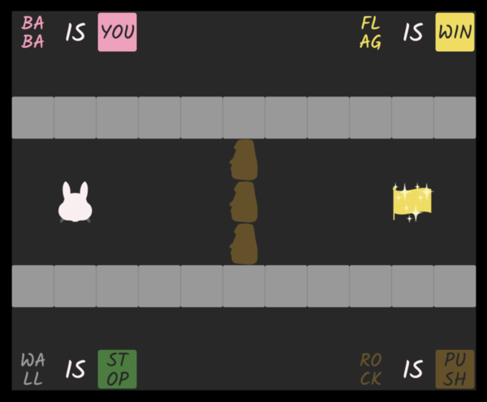

# Baba Is You

The goal of this project is to recreate the popular puzzle game [Baba Is You](https://hempuli.com/baba/) in vanilla JavaScript. It's just for fun; I'm not really looking for collaborators! I highly recommend purchasing the original game as it is a fantastic puzzler.



## Usage
- Clone the repo and run `npm install`
- Run `npm start` to build the assets and start a web server to serve the page
- Navigate to [http://localhost:1234](http://localhost:1234) in your browser
- Use arrow keys for movement, `z` to undo, and `x` to reset

#### TODO
- MOAR ICONS
- MOAR PROPERTIES
  - open/shut
  - hot/melt
  - float
- be able to deploy compiled src to gh pages
- baba is us (baba with websockets)
  - client sends player input to server
  - server applies input to current game state
  - server broadcasts current game state (or a stream of changes?) out to clients
  - clients render loop state/changes from server
  - server also has to manage connections and prevent level instances from having too many players at once
  - need a way to define different YOUs - usernames become text blocks?
  - also need to adjust map creation to account for spawn points of 4 blocks (username text, is, you, and user icon)
  - in-level chat would probably be helpful as well
  - level is not "won" until all players are on a win block
- edge case: what happens to the rock if the player moves up here? (reduced case, assume blank space in all directions)
  - ```
    _RrP_
    __s__
    __b__
    ```
  - the Is block occupies the same grid square as the rock icon
  - if the player moves up a second time, both the Is block and the rock icon move up (still on the same square)
    - this is the point at which this version diverges; since the state is kept as a string, we don't really understand that the rock and the Is occupy the same square at this point
    - this is due to the fact that History keeps track of previously-stepped icons, not Game, which means that the movement logic cannot account for both blocks in one move
    - need to change either the way we keep track of state to allow multiple blocks to occupy one grid space, or move the "covered blocks" tracking into the Game instance and account for it in Movement
    - potentially track state as a multidimensional array such that each grid square is an array
      - each block in a grid square is an object representing its block: `{ type: 'Joiner', name: 'Is' }`
      - empty array is Blank
      - this is stringifiable json and can work easily with the existing History class
      - what are the implications on things like `Rule.fromArray` and `Movement` if multiple blocks can inhabit one square?
        - for moves, possibly nothing, or minimal change? it's unlikely we could have more than two blocks per square (how would one set this up to happen in-game?) and a 2-block space would have to consist of a non-solid icon and a pushable block (again, how else would you set this up?) so one of the blocks will be steppable and the other will be pushable
        - for rules it's similar. the same thing applies here (re: steppable & pushable) but in this case we only care about Word blocks, so we should be able to reduce rows down to single blocks at a time and ignore any blocks that are not Words. it will require some amount of finagling to get flat arrays that represent grid rows without the blocks we don't care about though
  - if the player moves up a third time, the Is block is pushed up and the player steps on the rock icon
  - a fourth and final push leaves the rock icon in place and continues pushing the Is block

## Game Objects

All of these take up one grid space of a level. Icons have no collision by default. Words have collision and can always be pushed, regardless of any properties applied to them by rules.

- **Icons:** baba, rock, crab, jelly, wall, flag, key, door, etc
- **Nouns:** BABA, ROCK, etc (for every Icon there is a Noun)
- **Joiners:** IS, AND, HAS, NOT, ON, LONELY
- **Properties:** YOU, PUSH, STOP, WIN, DEFEAT, etc

[full list of words and rules](https://www.appunwrapper.com/2019/03/24/baba-is-you-words-and-rules-walkthrough-guide/)

[full list of levels w/ screenshots](https://www.ign.com/wikis/baba-is-you/Walkthrough)

## Rules

1. Nouns combine with Joiners and Properties to affect Icons.
2. Noun + IS + Property = Icon matching noun has property
3. Noun + IS + Property + AND + Property = Icons matching noun have any properties chained on by any number of ANDs
4. Noun + IS + Noun = Icons matching noun 1 turn into noun 2
5. Icons have no Properties unless a rule is defined by one of the above
   three combinations
6. Rules can only be defined top to bottom or left to right
7. If an Icon is transformed by a rule, the Nouns that made the rule
   cannot be used to transform said icon back to its original state
8. A level must always have a YOU block. If there are no Nouns connected
   to a YOU block, the player cannot move.
9. All moves can be undone, and all levels can be reset.
